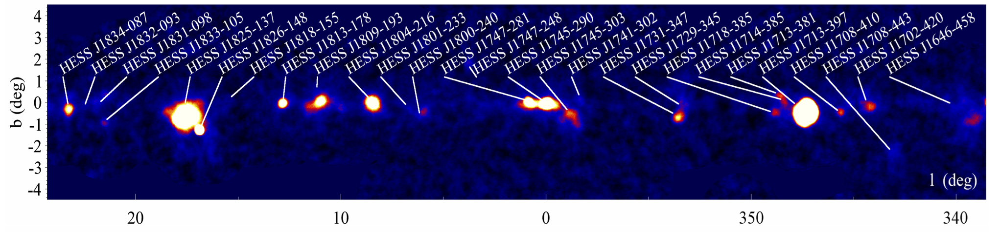

.. _galactic_center_explore_sources:

Explore Sources
===============

Download the 
`First Fermi-LAT Catalog of Sources above 10 GeV (1FHL) <http://fermi.gsfc.nasa.gov/ssc/data/access/lat/1FHL/>`_
like this::

   $ wget http://fermi.gsfc.nasa.gov/ssc/data/access/lat/1FHL/gll_psch_v07.fit

and the `LAT 2-year Point Source Catalog <http://fermi.gsfc.nasa.gov/ssc/data/access/lat/2yr_catalog/>`_
in FITS and ds9 region format like this::

   $ http://fermi.gsfc.nasa.gov/ssc/data/access/lat/2yr_catalog/gll_psc_v08.fit
   $ wget http://fermi.gsfc.nasa.gov/ssc/data/access/lat/2yr_catalog/gll_psc_v07.reg

HESS Galactic plane survey
--------------------------

   HESS survey image (TeV energy range).
   Reference: http://adsabs.harvard.edu/abs/2013arXiv1307.4690C
