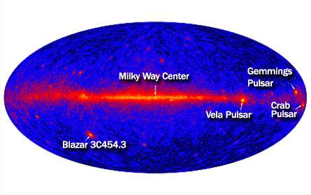

.. _galactic_center:

Galactic Center High-Energy View
================================

The `Galactic center <http://en.wikipedia.org/wiki/Galactic_Center>`_ and the `Galactic plane <http://en.wikipedia.org/wiki/Galactic_plane>`_
are amongst the most interesting regions in the Fermi-LAT all-sky survey.

In this tutorial we will use the Fermi science tools to investigate images of the diffuse emission and sources
in that region and end with a quick look at the hint for a spectral emission line at 130 GeV that
has recently caused a lot of excitement because if real it would most likely consitute the first
detection of `dark matter <http://en.wikipedia.org/wiki/Dark_matter>`_.   

.. toctree::
   :maxdepth: 1
   :numbered:

   intro
   maps
   line

