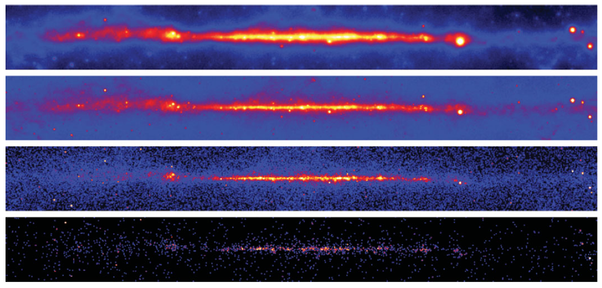
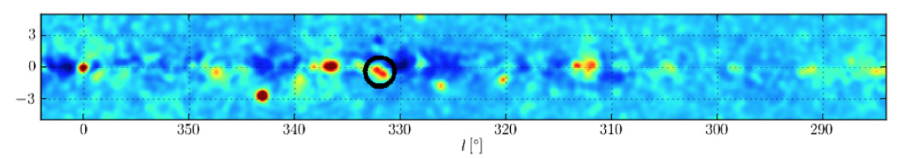
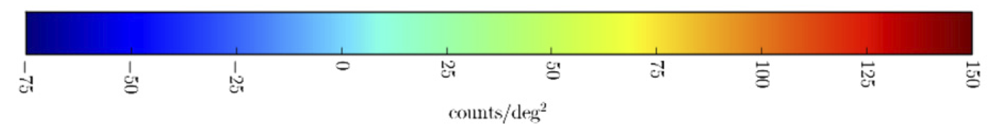

.. _galactic_center_intro:

Introduction
============

Overview
-------- 

In this tutorial we want to make an image of the sources in the Galactic plane,
using only photons above 10 GeV.

The Fermi LAT observes the whole gamma-ray sky in the energy band of roughly 100 MeV to 100 GeV,
with some exposure below and above that range.
The angular resolution (called the PSF) varies by almost two orders of magnitude from
~ 15 deg at 100 MeV to ~ 0.2 deg at 100 GeV. 
(Check out the `Fermi LAT Performance <http://www.slac.stanford.edu/exp/glast/groups/canda/lat_Performance.htm>`_
page for further information.)

Because of the high source density in the Galactic plane and the vert poor Fermi LAT angular resolution
at low energies it makes sense to only use the high-energy photons (we use E > 10 GeV here).  

One point to keep in mind though is that the Fermi LAT only detects very few photons at high energies,
because the Galactic diffuse and source emission roughly follows a differential power-law spectrum

.. math::

   \frac{dN}{dE} \sim F_0 \left(\frac{E}{E_0}\right)^{-\Gamma}

which corresponds to an integral power law spectrum of

.. math::

   N(>E) ~ E^{-\Gamma + 1}

with a **power law spectral index** of :math:`\Gamma \sim 2.6` for the Galactic diffuse emission and
often harder :math:`\Gamma \sim 1.8` to :math:`\Gamma \sim 2.6` source emission.

Note that for :math:`\Gamma = 2.6` there are more than two orders of magnitude difference
in the number of photons above a given energy when moving up one decade in energy, i.e. for the
Galactic diffuse emission the number of photons above 10 GeV in only 0.25% compared to the number
of photons above 1 GeV, and above 100 GeV it's only 0.00063% compared to 1 GeV.
 
With this background knowledge you should be able to understand the basic facts about the following
Fermi LAT count images in energy bands:

* Sources appear much smaller at high energies, simply because the PSF is so much better there.
* The drawback of only looking at high-energy photons is that they are few in numbers.
* The Galactic source to diffuse emission ratio increases with energy, i.e. sources are more prominent
  in the second panel compared to the first panel.

   Fermi LAT count maps of the Galactic plane (GLON = -180 deg to +180 deg, GLAT = -10 deg to +10 deg),
   smoothed with a Gaussian of 0.5 deg width in the energy bands 0.1 -- 1 -- 10 -- 100 -- 1000 GeV
   (top to bottom).
   The Crab (pulsar and nebula) is the bright source below the Galactic plane that can be
   even above 100 GeV.
   Taken from `Deil et al. (2012), IAU Symposium 284, 365D <http://adsabs.harvard.edu/abs/2012IAUS..284..365D>`_.

Sources
-------

In this tutorial we would like to produce an image showing only the Galactic source emission above 10 GeV,
with the diffuse Galactic and isotropic emission substracted.

We will do this via the formula ``excess = (total counts) - (diffuse model counts)``,
where the diffuse model consists of a Galactic and isotropic part. 
(For the Galactic plane the Galactic diffuse emission is much brighter than the isotropic diffuse emission,
so you can't see the isotropic diffuse emission in the images above). 

.. image:: fermi_survey_image_panel1.png
   :scale: 70 %

   Fermi LAT source excess maps (counts / deg^2, smoothed with a Gaussian of 0.27 deg width)
   of the Galactic plane in the energy range 10 GeV to 316 GeV.
   Galactic and isotropic diffuse emission as well as known sources that have been identified as blazars are subtracted.
   Taken from `Acero et al. (Fermi LAT collaboration) (2013), ApJ 773, 77A <http://adsabs.harvard.edu/abs/2013ApJ...773...77A>`_
   (top and bottom panel and colorbar only).
