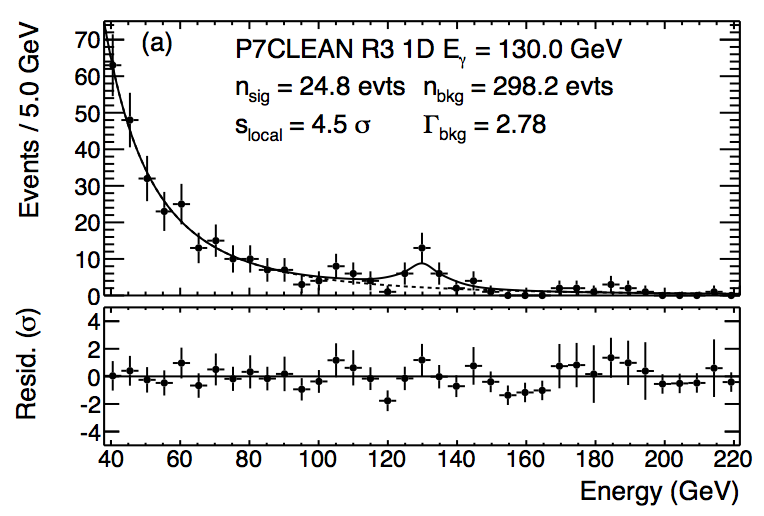
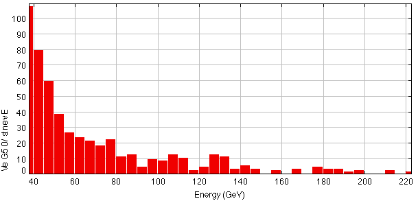
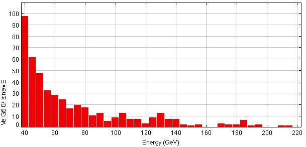
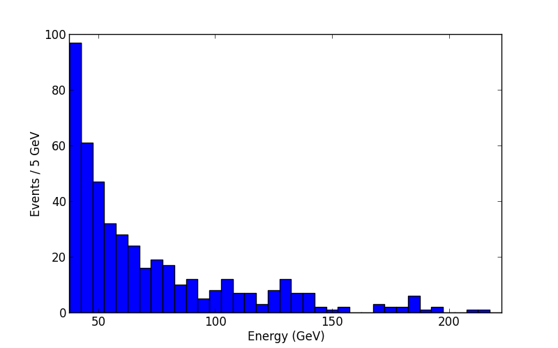

.. _galactic_center_line:

The 130 GeV line
================

What is it?
-----------

In April 2012 Christoph Weniger (not a member of the Fermi-LAT collaboration) reported
"A tentative gamma-ray line from Dark Matter annihilation at the Fermi Large Area Telescope"
(`arXiv <http://arxiv.org/abs/1204.2797>`_)
with a statistical significance of 4.6 sigma at 130 GeV,
and 3.2 sigma after taking into account the
`look-elsewhere effect <http://en.wikipedia.org/wiki/Look-elsewhere_effect>`_,
i.e. the fact that he did search for a line in multiple regions of the sky and at multiple energies.

This generated a lot of noise in the gamma-ray astrophysics community because,
if real, this 130 GeV gamma-ray emission line cannot easily be explained
by normal astrophysical sources ... for almost all sources we expect from theory
and also see power-law spectra ... sometimes with curvature or cutoff, but never with a sharp line feature.

On the other hand ... if the `dark matter <http://en.wikipedia.org/wiki/Dark_matter>`_
we know exists in the inner part of our Galaxy (all galaxies, actually)
consists of weekly interacting particles (`Wimps <http://en.wikipedia.org/wiki/Wimps>`_),
there are theories that predict them to annihilate and produce an emission line
consistent with the feature discovered in the Fermi LAT data. 

In May 2013 the Fermi LAT collaboration has reported their
"Search for Gamma-ray Spectral Lines with the Fermi Large Area Telescope and Dark Matter Implications"
(`arXiv <http://arxiv.org/abs/1305.5597>`_), computing the statistical significance of this
line feature at 130 GeV at a lower statistical significance of 3.3 sigma,
and only 1.6 sigma after taking the look-elsewhere effect into account.

You can find a nice summary and the latest results in
`this presentation <http://indico.cern.ch/getFile.py/access?contribId=64&sessionId=6&resId=0&materialId=slides&confId=221841>`_
by Andrea Albert at the recent `TeVPA 2013 conference <http://indico.cern.ch/conferenceDisplay.py?confId=221841>`_
if you don't have time to read the 40-page paper.

The full analysis is very complex and not suitable for beginners, but because it's such an interesting
feature, let's try to produce a similar plot as this one showing the line:

   Count spectrum showing the 130 GeV line for the region of 3 degrees around the Galactic center.
   Reference: `arXiv 1305.5597 <http://arxiv.org/abs/1305.5597>`_, Figure 11, top panel.

Event selection
---------------

As always we start by preparing the event list by running ``gtselect`` and ``gtmktime``.
Note that we can use the same photon files as input that we to make Galactic plane high-energy images,
because in both cases our event selection is a subset the event selection we specified when downloading the data.

Let's use the same region of interest (ROI) of 3 deg around the Galactic center 
and no energy cut at this point::

   $ gtselect infile=@events.txt outfile=line_gtselect.fits \
     ra=266.404996 dec=-28.936172 rad=3 tmin=INDEF tmax=INDEF \
     emin=10000 emax=1000000 zmax=100 evclass=2

   $ gtmktime scfile=../../spacecraft.fits evfile=line_gtselect.fits \
     filter="DATA_QUAL==1&&LAT_CONFIG==1&&ABS(ROCK_ANGLE)<52" \
     roicut=yes outfile=line_gtmktime.fits

Quick look with TOPCAT
----------------------

Try to use TOPCAT to reproduce this counts histogram.

* Enter ``1e-3 * ENERGY`` instead of only ``ENERGY`` to get GeV instead of MeV.
* Binning selection: 37.5 GeV to 222.5 GeV with 5 GeV bin width (37 bins)
* There should be TODO events.
* Please also label the axes as shown.
* Export the plot in PNG as well as PDF format and check it with some other viewer.

Note how the visual impression changes of the shape of the peak (amplitude, width) changes if you move the bins by half a bin width: 

Note that we will not reproduce the Fermi LAT collaboration result exactly,
the main reason being that we use a slightly longer exposure
(i.e. a larger time range of observation) and thus will have more events.

The Fermi plot has 24.8 + 298.2 = 323 according to the label.
If you click ``Subsets -> New subset from visible`` in TOPCAT you will see that we have 412 events.

Nice plot with Python ``matplotlib``
------------------------------------

The Fermi science tools ships with two Python packages that you can use to make plots: 

* `ROOT <http://root.cern.ch>`_ can be used from Python like this: ``import ROOT``
* `matplotlib <http://matplotlib.org/>`_ can be used from Python like this: ``import matplotlib.pyplot as plt``

.. note:: In my opinion, the ``matplotlib`` import looks more complicated, but apart from that it is better documented
   and easier to use and more powerful than ``ROOT`` plotting. But both have a learning curve ... we suggest you
   try out both a bit, then stick with the one you like better.

Let's use ``matplotlib`` to make the same plot with a Python script.
The advantage of making plots with a script instead of interactively is that they are reproducible
and usually will result in less human error, but also less work because typically you re-run your analyses
many times, checking how results change when you vary parameters or update data or correct errors. 

Here is the script ... put this in a file called ``plot_line.py``:

.. literalinclude:: plot_line.py
   :emphasize-lines: 2
   :linenos:

This is the command to run the script from the terminal::

   $ python plot_line.py 
   Number of events: 462
   $

TODO: Check why this number (462) is different from the one I got with TOPCAT (412)!?

And here's the output:

Conclusion
----------

So what do you think is the origin of the line feature?

Note that there's a ~ 5% chance that the line is simply a Poisson background fluctuation.
To compute this probability from the given significance you can use
`scipy.stats.norm <http://docs.scipy.org/doc/scipy/reference/generated/scipy.stats.norm.html>`_,
althogh for me currently the import fails with the Fermi ScienceTools Python:: 
 

   $ ipython
   
   In [1]: from scipy.stats import norm
   
   In [2]: norm.sf(1.6)
   Out[2]: 0.054799291699557974
