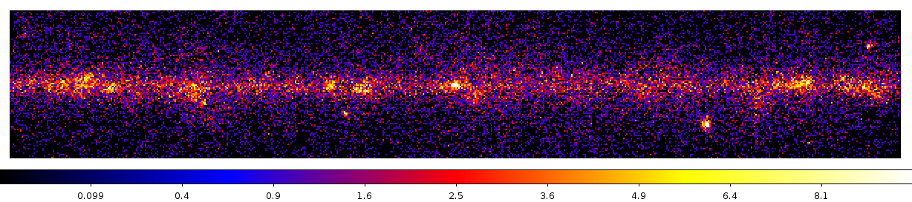
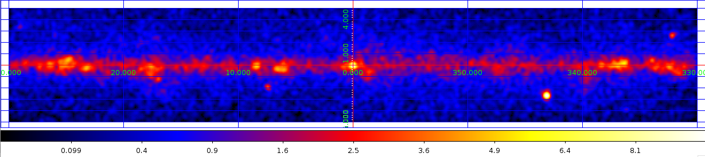
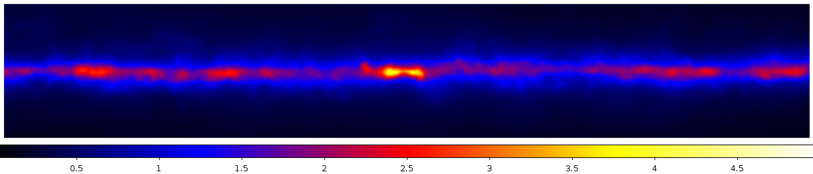

.. _galactic_center_science_tool_images:

Create count and and model images with the Fermi Science Tools
==============================================================

Make a count image with ``gtbin``
---------------------------------

Run `gtbin <http://fermi.gsfc.nasa.gov/ssc/data/analysis/scitools/help/gtbin.txt>`_ to make a counts image:: 

   $ gtbin
   This is gtbin version ScienceTools-v9r31p1-fssc-20130410
   Type of output file (CCUBE|CMAP|LC|PHA1|PHA2|HEALPIX) [] CMAP 
   Event data file name[] gtmktime.fits
   Output file name[] count_image.fits
   Spacecraft data file name[] ../../spacecraft.fits 
   Size of the X axis in pixels[] 600
   Size of the Y axis in pixels[] 100
   Image scale (in degrees/pixel)[] 0.1
   Coordinate system (CEL - celestial, GAL -galactic) (CEL|GAL) [] GAL
   First coordinate of image center in degrees (RA or galactic l)[] 0
   Second coordinate of image center in degrees (DEC or galactic b)[] 0
   Rotation angle of image axis, in degrees[] 0
   Projection method e.g. AIT|ARC|CAR|GLS|MER|NCP|SIN|STG|TAN:[] CAR

Open up the image in `ds9 <https://hea-www.harvard.edu/RD/ds9/site/Home.html>`_
and use the following commands to get an image that looks like this:

* Select Scale -> Scale Parameters and ``sqrt`` with range 0 to 10.
* Color -> b

Now use these options to get the following view of the same counts image:

* ``Analysis -> Smooth Parameters`` with a 3 pixel Gauss kernel
* Analysis -> Coordinate grid
* WCS -> Galactic and WCS -> Degrees 

Make a model image with ``gtbin``, ``gtexpcube2`` and ``gtmodel``
-----------------------------------------------------------------

Next we want to make a model image (a.k.a an "expected counts image") for the
diffuse Galactic and isotropic emission. See
`here <http://fermi.gsfc.nasa.gov/ssc/data/access/lat/BackgroundModels.html>`_
for information on these diffuse model components that are considered "background"
for gamma-ray source analysis. 

To get this image we need to run the following three Fermi ScienceTools in sequence:

* `gtbin <http://fermi.gsfc.nasa.gov/ssc/data/analysis/scitools/help/gtbin.txt>`_ with the ``CCUBE`` option.
* `gtexpcube2 <http://fermi.gsfc.nasa.gov/ssc/data/analysis/scitools/help/gtexpcube2.txt>`_
* `gtmodel <http://fermi.gsfc.nasa.gov/ssc/data/analysis/scitools/help/gtmodel.txt>`_

First we need to describe the model, which we do in the `XML <http://en.wikipedia.org/wiki/XML>`_ file ``diffuse_model.xml``:

.. literalinclude:: diffuse_model.xml
   :emphasize-lines: 2
   :linenos:

Next we create `symbolic links <http://en.wikipedia.org/wiki/Symbolic_link>`_ to the diffuse model files
that come with the Fermi Science tools software distribution so that the tools will find them:

::

   ln -s $FERMI_DIR/refdata/fermi/galdiffuse/gal_2yearp7v6_v0.fits .
   ln -s $FERMI_DIR/refdata/fermi/galdiffuse/iso_p7v6source.txt .

Now we can run the tools to compute exposure and the PSF-convolved model image using these commands::

   $ gtbin evfile=gtmktime.fits scfile=../../spacecraft.fits outfile=count_cube.fits \
     algorithm=CCUBE ebinalg=LOG emin=10e3 emax=316e3 enumbins=8 \
     nxpix=600 nypix=100 binsz=0.1 coordsys=GAL \
     xref=0 yref=0 axisrot=0 proj=CAR

   $ gtexpcube2 infile=gtltcube.fits cmap=none outfile=gtexpcube2.fits \
     irfs=P7SOURCE_V6 nxpix=1800 nypix=900 binsz=0.2 coordsys=GAL \
     xref=0 yref=0 axisrot=0 proj=AIT \
     emin=10e3 emax=316e3 enumbins=8 bincalc=EDGE

   $ gtmodel srcmaps=count_cube.fits srcmdl=diffuse_model.xml \
     outfile=model_image.fits irfs=P7SOURCE_V6 \
     expcube=gtltcube.fits bexpmap=gtexpcube2.fits

On my machine ``gtbin`` takes 5 seconds, ``gtexpcube2`` takes 1 minute and ``gtmodel`` takes 5 minutes.

.. note:: Exercise: Inspect the generated files with ``ftlist`` and ``ds9`` to see what they contain.

Consult the official Fermi LAT `Binned Likelihood Tutorial <http://fermi.gsfc.nasa.gov/ssc/data/analysis/scitools/binned_likelihood_tutorial.html>`_
analysis thread for detailed information.
