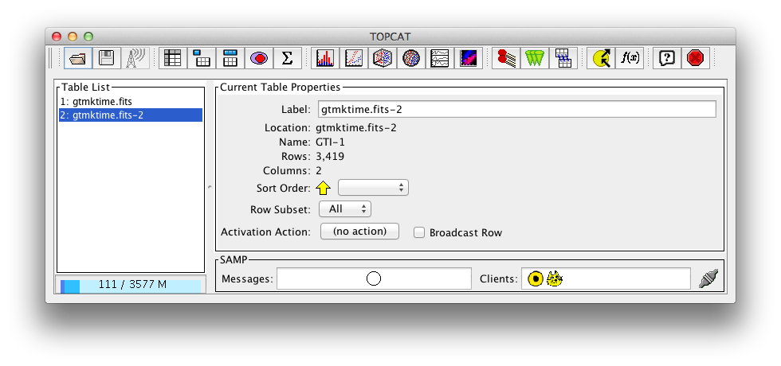
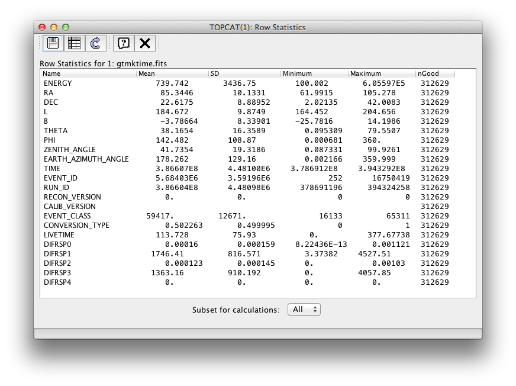
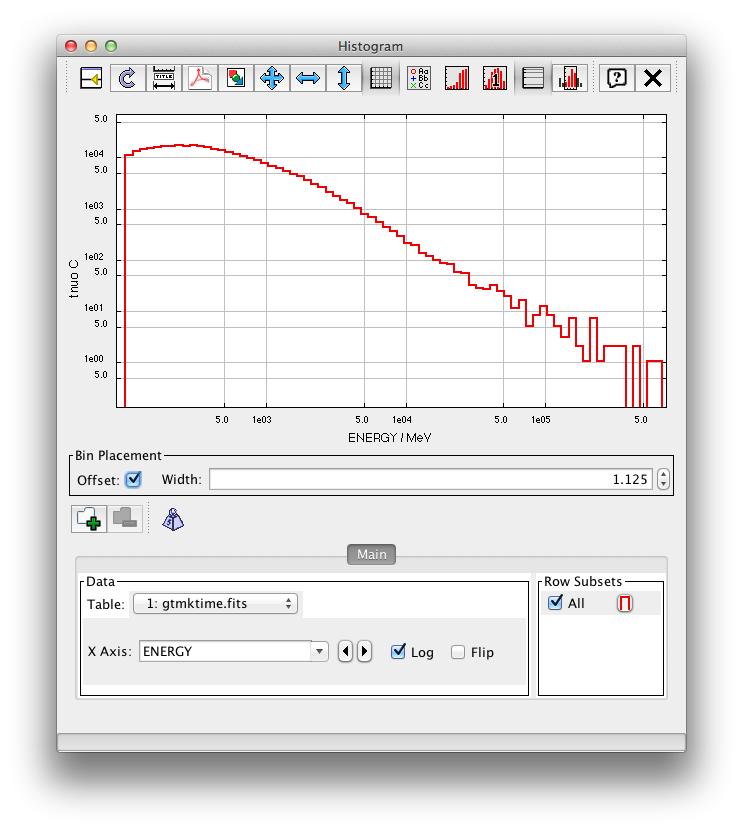
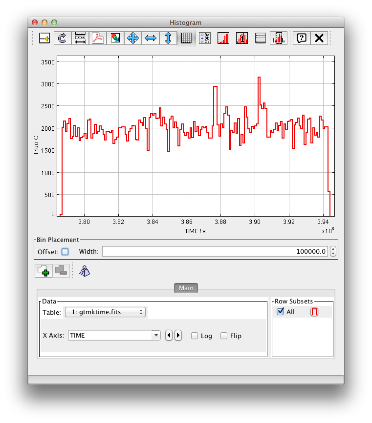

.. _getting_started_explore_events:

Explore Fermi LAT photon data with ``TOPCAT``
=============================================

Now that we have a prepared the event list to only contain astrophysical photons
let's have a look at the ``(RA, DEC)``, ``(L, B)`` as well as ``ENERGY`` and ``TIME``
distributions of the events.

TOPCAT
------

`TOPCAT <http://www.star.bris.ac.uk/~mbt/topcat/sun253/sun253.html>`_ is the
"Tool for OPerations on Catalogues And Tables".
Open the preprocessed event list with will open the main window with ``TOPCAT`` in the title and
by default select the ``GTI`` HDU (called location ``gtmktime.fits-2`` and name ``GTI-1``)::

   $ topcat gtmktime.fits

* In the table list on the left side of the main window, select the first HDU.
  You should see ``Name: EVENTS-1`` in the ``Current Table Properties`` section.
* Open the ``Row Statistics`` window by clicking the button with the upper-case greek sigma.

Using TOPCAT is quite easy and it has a good manual, so we will not give detailed instructions how
to make the following plots ... with some trial and error you should be able to figure it out yourself.

Spatial distribution
--------------------

TODO: explain sources and diffuse emission and PSF
Point to :ref:`getting_started_image_and_source_catalog` tutorial and :ref:`galactic_center` tutorial.

Energy distribution
-------------------

Try to create the following histogram to look at the energy distribution:

TODO: explain shape: source power-law spectra and Fermi-LAT effective area.
Point to :ref:`spectrum` tutorial.

Time distribution
-----------------

Next try to create the following histogram to look at the time distribution
(which is proportional to the event rate since we use equal-width time bins). 

TODO: explain shape via obs strategy and IRF (and possibly source variability).
Point to :ref:`lightcurve` tutorial.

.. image:: lat_cntmap_weekly_merged_soft.gif
   :scale: 100 %

