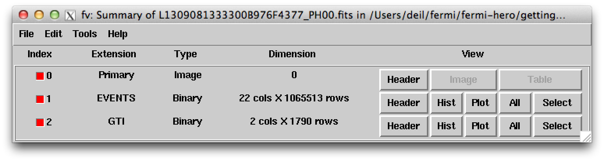

.. _getting_started_first_look:

First look at Fermi LAT photon files with ``ftlist`` and ``fv``
===============================================================

**Event files** like ``L1309081333300B976F4377_PH00.fits`` are `FITS <http://fits.gsfc.nasa.gov/>`_ files.
**FITS** is the standard data format in astronomy for arrays (e.g. 2D images) and tables (e.g. source catalogs or event lists). 

Let's use a few different tools to explore the content of ``L1309081333300B976F4377_PH00.fits``.

List photon file contents with ``ftlist``
-----------------------------------------

`ftlist <http://heasarc.gsfc.nasa.gov/ftools/caldb/help/ftlist.html>`_ is a command-line tool to ... duh ... list the content of FITS files.
A FITS file consists of **header-data units (HDUs)**, where each HDU is an array or table.
For historic reasons the first HDU (a.k.a. primary HDU) has to be an array, so in
FITS files that only contain tabular data the primary HDU will be a dummy, empty HDU.

Giving a filename and the print option ``H`` to list a 1-line summary of the HDUs to ``ftlist`` we get::

   $ ftlist L1309081333300B976F4377_PH00.fits H
   
           Name               Type       Dimensions
           ----               ----       ----------
   HDU 1   Primary Array      Null Array                               
   HDU 2   EVENTS             BinTable    22 cols x 1065513 rows       
   HDU 3   GTI                BinTable     2 cols x 1790 rows          

So this **event file** contains an ``EVENTS`` table with 1065513 events and a ``GTI`` (good time interval) table with 1790 GTIs.
GTIs are needed to compute exposure. Exposure is needed to compute the flux of sources.

To list the names and units of the columns in the ``EVENTS`` and ``GTI`` table use the ``C`` print option with ``ftlist``::

   $ ftlist L1309081333300B976F4377_PH00.fits C
   HDU 2  
   
     Col  Name             Format[Units](Range)      Comment
       1 ENERGY             E [MeV] (0.:10000000.) 
       2 RA                 E [deg] (0.:360.)    
       3 DEC                E [deg] (-90.:90.)   
       4 L                  E [deg] (0.:360.)    
       5 B                  E [deg] (-90.:90.)   
       6 THETA              E [deg] (0.:180.)    
       7 PHI                E [deg] (0.:360.)    
       8 ZENITH_ANGLE       E [deg] (0.:180.)    
       9 EARTH_AZIMUTH_ANGLE E [deg] (0.:360.)    
      10 TIME               D [s] (0.:10000000000.) 
      11 EVENT_ID           J (0:2147483647)     
      12 RUN_ID             J (0:2147483647)     
      13 RECON_VERSION      I (0:32767)          
      14 CALIB_VERSION      3I                   
      15 EVENT_CLASS        J (0:32767)          
      16 CONVERSION_TYPE    I (0:32767)          
      17 LIVETIME           D [s] (0.:10000000000.) 
      18 DIFRSP0            E (0.:1.0E+38)       
      19 DIFRSP1            E (0.:1.0E+38)       
      20 DIFRSP2            E (0.:1.0E+38)       
      21 DIFRSP3            E (0.:1.0E+38)       
      22 DIFRSP4            E (0.:1.0E+38)       
   
   HDU 3  
   
     Col  Name             Format[Units](Range)      Comment
       1 START              D [s] (0.:10000000000.) 
       2 STOP               D [s] (0.:10000000000.) 

To print the content of the ``EVENTS`` table extension give the extension name in square brackets
after the filename use the ``T`` print option with ``ftlist``::

   $ ftlist L1309081333300B976F4377_PH00.fits[EVENTS] T rows=1-10 columns=ENERGY,RA,DEC,TIME
   
               ENERGY             RA            DEC                    TIME
                  MeV            deg            deg                       s
     1        398.907        94.0848        5.88669        378713295.231454
     2        425.700        91.8646        7.99151        378724463.542101
     3        262.569        93.0315        4.90930        378724578.466829
     4        683.413        90.3001        3.16895        378725356.681894
     5        889.776        90.3241        7.67446        378725486.282723
     6        566.726        90.3723        7.70085        378719151.132736
     7        305.036        91.6181        6.04271        378719248.977633
     8        140.088        94.2944        5.68424        378736517.165258
     9        184.310        91.1134        4.95412        378736587.650162
    10        138.277        92.4515        5.60271        378742238.959606

``ftlist`` is just one of many command line tools to work with FITS files,
called the `FTOOLS <http://heasarc.gsfc.nasa.gov/ftools/>`_,
which you get as part of a package called `HEASOFT <http://heasarc.gsfc.nasa.gov/lheasoft/>`_.

You should know that for each FTOOL you can get the help page locally quickly by using ``fhelp <tool name>``::

   $ fhelp ftlist

Sometimes this will open up the help page in the terminal, sometimes in HTML format in your web browser.

To quickly see list the parameters of a given FTOOL use `plist <https://heasarc.gsfc.nasa.gov/ftools/caldb/help/plist.txt>`_::

   $ plist ftlist
   Parameters for /Users/deil/pfiles/ftlist.par
          infile = L1309081333300B976F4377_PH00.fits[EVENTS] Input file name 
          option = T                Print options: H C K I T 
        (outfile = -)               Optional output file 
        (clobber = No)              Overwrite existing output file? 
        (include = *)               Include keywords list 
        (exclude = )                Exclude keywords list 
        (section = *)               Image section to print, eg, '2:8,1:10' 
        (columns = *)               Table columns to print 
           (rows = -)               Table rows or ranges to print, eg, '2,6-8' 
         (vector = -)               Vector range to print, eg, '1-5' 
      (separator =  )               Column separator string 
         (rownum = Yes)             Print row number? 
      (colheader = Yes)             Print column header? 
           (mode = ql)              Mode 

You see the parameter name, last or default value and a short description.
There are required parameters (the ones without parentheses)
that you will be quoted for interactively if not given on the command line.
And there are optional parameters (the ones in parentheses) that you have to
give on the command line if you want to choose a different value than the default.

Plot a photon zenith angle histogram with ``fv``
------------------------------------------------

Next let's use `Fv: The Interactive FITS File Editor <http://heasarc.gsfc.nasa.gov/ftools/fv/>`_.
``ftlist`` was a command line tool ... ``fv`` is a GUI (graphical user interface) tool.

Open ``fv`` and the event file like this::

   $ fv L1309081333300B976F4377_PH00.fits

or if you prefer to run ``fv`` in the background like this::

   $ fv L1309081333300B976F4377_PH00.fits &

The advantage of running tools in the background is that you can execute other commands without having
to wait for the tool to finish or having to open an extra terminal window. 

``fv`` is very powerful, but because it's so ugly that it probably makes your eyes hurt we'll only use it to do one thing:
plot a the distribution of the ``ZENITH_ANGLE`` of the ``EVENTS``.

* Click the ``Histogram`` button for the ``EVENTS`` HDU.
* In the dialog window called ``Histogram`` select ``ZENITH_ANGLE`` as column name for ``X``.
  In this case the default binning options are reasonable ... click ``Make/Close``.
* Done. A window called ``POW`` shows the zenith angle histogram.
* In the fv menu click ``Quit``, then ``No to All`` in the exit dialog window to confirm that you
  don't want to permanently save the temp histogram file.  

.. image:: fv_pow.png
   :scale: 50 %

The zenith angle histogram shows a broad peak in the range 0 deg to 100 deg,
and a narrow peak around 113 deg.

We'll explain the origin and relevance of this distribution in the next section
:ref:`getting_started_prepare_data`.
