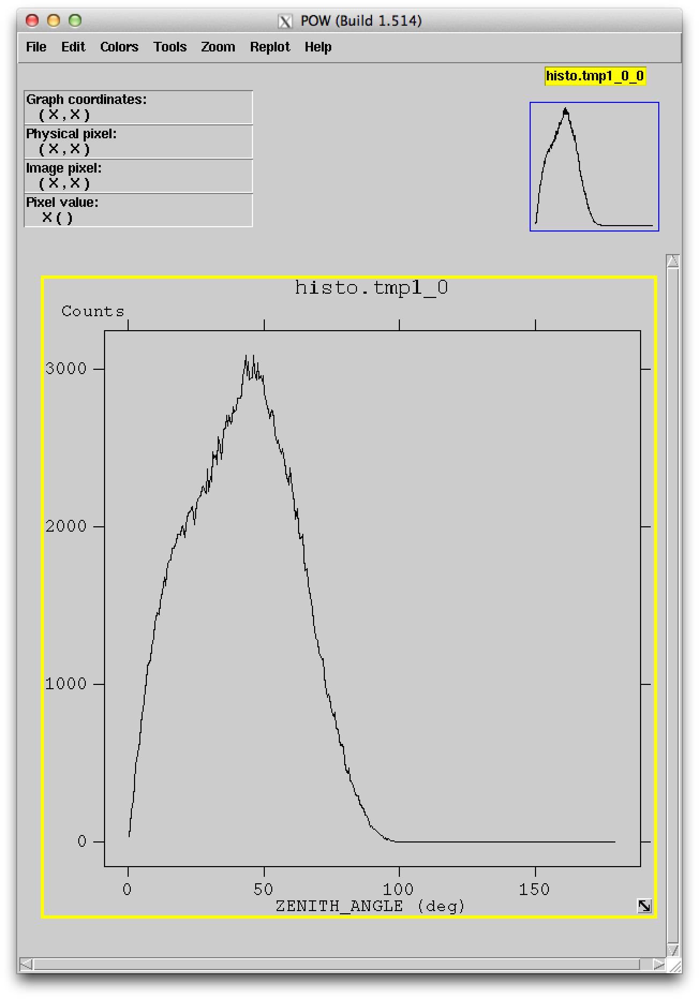

.. _getting_started_prepare_data:

Prepare Fermi LAT data with ``gtselect`` and ``gtmktime``
=========================================================

In the last section we made a histogram of the photon
zenith angle distribution and found a broad peak in the range 0 to 100 deg
and a narrow peak around 113 deg.

The narrow peak at a zenith angle of ~ 113 deg is due to "atmospheric gamma rays"
as explained in the following Figure (which also explains what the zenith angle is).

.. figure:: earth_limb_gammas.png
   :scale: 70 %

   Schematic of Limb gamma-ray production by cosmic ray interactions in the Earth’s atmosphere,
   showing the definitions of the zenith angle (θz), the spacecraft rocking angle (θr) and the incidence angle (θ).
   Reference: http://adsabs.harvard.edu/abs/2013arXiv1305.5597F

We are not interested in atmospheric gamma rays, only in gamma rays from (non-atmospheric) astrophysical sources.

To apply selection cuts that remove the atmospheric gammas we will use
the ``gtselect`` and ``gtmktime`` **Fermi Science Tools** (the Fermi LAT FTOOLS).
Running these two tools has other purposes, too, e.g. selecting an **event class** (see
`LAT Data Selection Recommendations <http://fermi.gsfc.nasa.gov/ssc/data/analysis/documentation/Cicerone/Cicerone_Data_Exploration/Data_preparation.html>`_
for more information).

We will not describe the details of what happens here ... if you are interested read the
`Fermi LAT Data Preparation analysis thread <http://fermi.gsfc.nasa.gov/ssc/data/analysis/scitools/data_preparation.html>`_
and follow the links given there. 

``gtselect`` takes an FITS event file as input and writes a subset of events to an output FITS event file.
If you have more than one input FITS event file you have to create a text file containing the names
of all FITS event files you'd like to process ... one file per line. 

Use the command line `ls <http://en.wikipedia.org/wiki/Ls>`_ utility to create the text file
and the `cat <http://en.wikipedia.org/wiki/Cat_(Unix)>`_ utility to print it's contents to
the terminal to check that it worked::

   $ ls -1 *_PH??.fits > events.txt
   $ cat events.txt 
   L1309081333300B976F4377_PH00.fits
   L1309081333300B976F4377_PH01.fits

Now run `gtselect <http://fermi.gsfc.nasa.gov/ssc/data/analysis/scitools/help/gtselect.txt>`_
and select event class 2, corresponding to `P7SOURCE_V6`, as well as a maximum zenith angle of 100 deg as recommended
`here <http://fermi.gsfc.nasa.gov/ssc/data/analysis/documentation/Cicerone/Cicerone_Data_Exploration/Data_preparation.html>`_::

   $ gtselect evclass=2 
   Input FT1 file[] @events.txt 
   Output FT1 file[] gtselect.fits
   RA for new search center (degrees) (0:360) [] INDEF
   Dec for new search center (degrees) (-90:90) [] INDEF
   radius of new search region (degrees) (0:180) [] INDEF
   start time (MET in s) (0:) [] INDEF
   end time (MET in s) (0:) [] INDEF
   lower energy limit (MeV) (0:) [] 100
   upper energy limit (MeV) (0:) [] 1000000
   maximum zenith angle value (degrees) (0:180) [] 100
   Done.

Note that we had to specify the ``evclass`` parameter on the command line,
because it's a hidden FTOOL parameter::

   $ plist gtselect
   Parameters for /Users/deil/pfiles/gtselect.par
          infile = @events.txt      Input FT1 file
         outfile = gtselect.fits    Output FT1 file
              ra = INDEF            RA for new search center (degrees)
             dec = INDEF            Dec for new search center (degrees)
             rad = INDEF            radius of new search region (degrees)
            tmin = INDEF            start time (MET in s)
            tmax = INDEF            end time (MET in s)
            emin = 100              lower energy limit (MeV)
            emax = 1000000          upper energy limit (MeV)
            zmax = 100              maximum zenith angle value (degrees)
       (evclsmin = INDEF)           Minimum event class ID
       (evclsmax = INDEF)           Maximum event class ID
        (evclass = 2)               Event class selection (e.g. 0=Transient, 2=Source)
       (convtype = -1)              Conversion type (-1=both, 0=Front, 1=Back)
       (phasemin = 0)               minimum pulse phase
       (phasemax = 1)               maximum pulse phase
        (evtable = EVENTS)          Event data extension
        (chatter = 2)               Output verbosity
        (clobber = yes)             Overwrite existing output files
          (debug = no)              Activate debugging mode
            (gui = no)              GUI mode activated
           (mode = ql)              Mode of automatic parameters

Sometimes it's convenient to give the parameters on the command line
to avoid the interactive prompt.

E.g. after you've done a few Fermi data analyses you'll get tired
of running the tools interactively and will want to use scripts
where you substitute in the correct parameters in the correct places.
`Shell scripts <http://en.wikipedia.org/wiki/Shell_script>`_,
`Makefiles <http://en.wikipedia.org/wiki/Make_(software)>`_ or
`Python scripts <http://en.wikipedia.org/wiki/Python_(programming_language)>`_
are common choices.

Later in this tutorial you'll use
a set of easy-to-use Fermi LAT data analysis Python scripts called
`Enrico <http://enrico.readthedocs.org/en/latest/>`_ to do the busywork.

The following command is equivalent to the ``gtselect`` command given above
... you can simply copy & paste it in you terminal::

   $ gtselect infile=@events.txt outfile=gtselect.fits \
     ra=INDEF dec=INDEF rad=INDEF tmin=INDEF tmax=INDEF \
     emin=100 emax=1000000 zmax=100 evclass=2

The backslash tells the terminal that the command is not finished and will continue on the next line.

Did you note how we used ``INDEF`` to denote "don't apply an additional cut" for the region of interest (ROI)
and the time range?
``INDEF`` doesn't work for the energy range apparently, so we had to repeat the 
selection we made when downloading the data: 100 MeV to 1,000,000 MeV = 1 TeV.  

If you ever forget what **Data Sub Space (DSS)** selections you applied when downloading
the data or processing it with ``gtselect`` or ``gtmktime``, you can use the 
`gtvcut <http://fermi.gsfc.nasa.gov/ssc/data/analysis/scitools/help/gtvcut.txt>`_ tool
to display a summary::

   $ gtvcut L1309081333300B976F4377_PH00.fits EVENTS
   DSTYP1: TIME
   DSUNI1: s
   DSVAL1: TABLE
   DSREF1: :GTI
   
   GTIs: (suppressed)
   
   DSTYP2: BIT_MASK(EVENT_CLASS,2)
   DSUNI2: DIMENSIONLESS
   DSVAL2: 1:1
   
   DSTYP3: POS(RA,DEC)
   DSUNI3: deg
   DSVAL3: CIRCLE(83.633083,22.0145,20)
   
   DSTYP4: TIME
   DSUNI4: s
   DSVAL4: 378691200:394329600
   
   DSTYP5: ENERGY
   DSUNI5: MeV
   DSVAL5: 100:1000000

Back to business ... let's finish the data preparation by running ``gtmktime``
using the recommended parameters from
`here <http://fermi.gsfc.nasa.gov/ssc/data/analysis/documentation/Cicerone/Cicerone_Data_Exploration/Data_preparation.html>`_:: 

   $ gtmktime
   Spacecraft data file[] ../spacecraft.fits
   Filter expression[] DATA_QUAL==1&&LAT_CONFIG==1&&ABS(ROCK_ANGLE)<52
   Apply ROI-based zenith angle cut[] yes
   Event data file[] gtselect.fits
   Output event file name[] gtmktime.fits

.. note:: For this tutorial I chose to name the ``gtselect`` tool output file ``gtselect.fits``
   and the ``gtmktime`` output file ``gtmktime.fits``.
   I find this convention of using the tool name as output file name easy to remember,
   but you can choose any file names you like of course.

Before moving on to the next section, which will explain a bit what ``gtselect`` and
``gtmktime`` have done, let's use ``fv`` again to plot the ``ZENITH_ANGLE`` distribution
of ``gtmktime.fits``. As expected, there are no events with ``ZENITH_ANGLE > 100`` deg any more.

