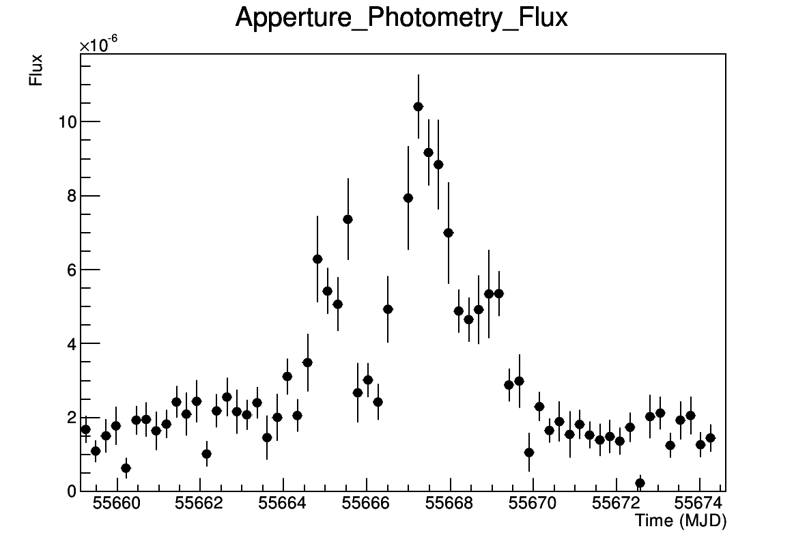

.. _lightcurve:

Aperture Lightcurve
===================

In this section of the tutorial we will learn how to generate an aperture
lightcurve from Fermi/LAT. 

There are two different kinds of lightcurves that can be computed from Fermi/LAT
observations: using likelihood analysis on each of the lightcurve bins, or
aperture analysis. The likelihood analysis leads to a better sensitivity and the
ability to obtain background-substracted flux lightcurves, but is
model-dependent and very computationally intensive, especially for longer
periods of time. Aperture lightcurve generation, on the other hand, is less
computationally demanding and provides a model-independent estimate of the
variability of a given source. However, there is no way to do an estimation of
the background, so it should not be used to estimate the source's flux.

Here we will compute the aperture lightcurve of the remarkable April 2011 flare
from the Crab Nebula. The Crab Nebula has been used for decades as the standard
candle in High Energy Astrophysics, as it is bright and expected to have a
constant flux. However, Fermi/LAT discovered that its flux is far from constant,
exhibiting flux changes of a factor of 10 or more over just a few hours. The
astrophysical process behind these flares is still unkown.

.. figure:: buehler.png
   :width: 80%

   Fermi/LAT lightcurve of the April 2011 Crab Nebula flare as published in
   `Buehler et al. (2012), ApJ 749, 26 <http://arxiv.org/abs/1112.1979>`_ 

In this tutorial we assume that you have already installed and initialized the Fermi Science
Tools as well as ``enrico``.

Change directory to where you have extracted the tutorial data files and enter
the ``CrabNebula`` directory. There you will find photon and spacecraft data
downloaded from the LAT data server with the parameters specified in the
``LAT_server_query.txt`` file. 

Generate an configuration file for this observation with the command::

    $ enrico_config crab.conf
    
and enter the name and coordinates of the source (you
will find them in ``LAT_server_query.txt``). For the aperture lightcurve, the
model and ROI size parameters are not used, so leave them to their default
values. Make sure to enter the FT2 (spacecraft file) and FT1 (photon file) with their
absolute paths. Finally, select the initial and final analysis times as given in
the server query file.

You can the edit the file ``crab.conf`` to check the parameters. In addition to
the ``target``, ``space``, ``file``, and ``time`` categories, the ``AppLC`` configuration
category includes the values used by ``enrico`` when creating the aperture
lightcurve. Use the ``NLCbin`` parameter to set the number of bins desired in the
lightcurve between ``tmin`` and ``tmax``. Given that the total selection time in the photon
file is 16 days, 32 bins will result in a bin width of 12 hours, and 64 bins in
a bin width of 24 hours. You can try different bin widths to check which one
yields the most informative lightcurve, taking into account that shorter time
bin widths will result in larger uncertainties.  Then run the aperture lightcurve
enrico script: ::

    $ enrico_applc crab.conf

This scrip will run the following tasks:

1. **gtselect** : Select the events from the input FT1 file.
2. **gtmktime** : Compute good time intervals based on spacecraft pointing and
   SAA position.
3. **gtbin** : Bin the data into a lightcurve.
4. **gtexposure** : Compute the exposure (effective area*observation time) for
   each of the bins.
5. From the results of **gtbin** and **gtexposure**, lightcurve plots are generated in the ``AppertureLightcurve`` directory.

The resulting aperture lightcurve will be saved in
``AppertureLightcurve/AppLC.eps``, and should reproduce the two peaks shown in 
Buehler et al. (2012) as seen in the following example:

