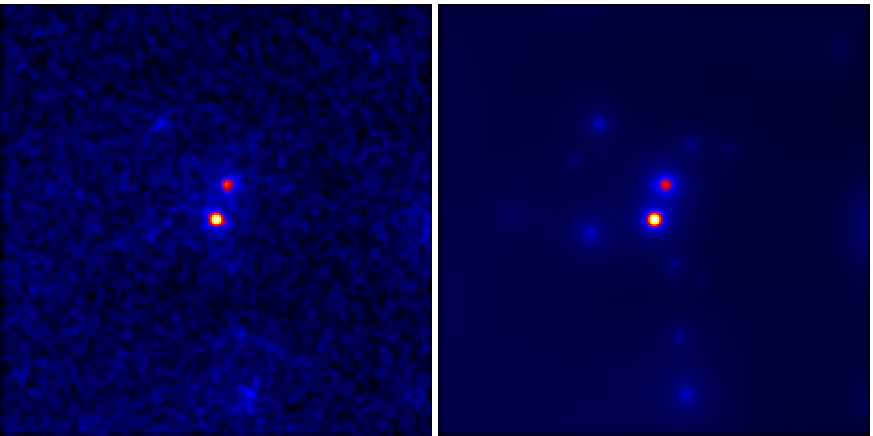
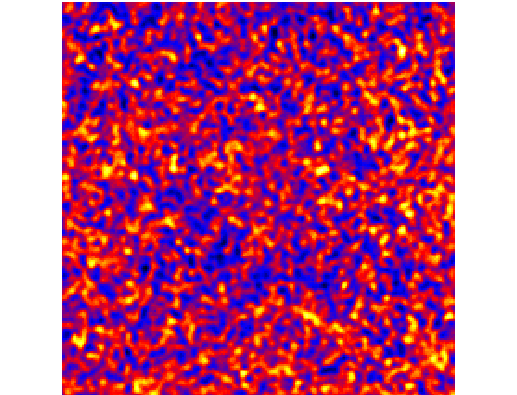

.. _spectrum:

Spectrum
========

In this tutorial we will perform a full likelihood analysis of the AGN
PG1553+113. We will use the same dataset already used in the `official Fermi/LAT
collaboration likelihood tutorial
<http://fermi.gsfc.nasa.gov/ssc/data/analysis/scitools/python_tutorial.html>`_
as well as in the `enrico tutorial
<http://enrico.readthedocs.org/en/latest/tutorial.html>`_, so that you can check
your results and have additional information by consulting the two other
webpages.

A note on directory structure
-----------------------------

In order to avoid confusions, it is always best to provide absolute paths for
all the files in the analysis. In this tutorial we will assume that you have
extracted the ``fermi-hero.tar.gz`` data tarball to the home directory of your
user (here, as an example, we use the username ``hero``), so that the directory
structure looks like this:

.. code-block:: bash
    
    $ cd /home/hero/fermi-hero
    $ ls
    excercises  solutions  spacecraft.fits
    $ ls excercises/spectrum/
    L120405112547B0489E7F68_PH00.fits

To start the tutorial, change directory to
``/home/hero/fermi-hero/excercises/spectrum``.

Make a config file
------------------

``enrico`` uses configuration files to run analysis (for a full description see
`the enrico documentation on the configuration files
<http://enrico.readthedocs.org/en/latest/configfile.html>`_).

You can use the `enrico_config` tool to quickly make a config file
called `pg1553.conf`. It will ask you for the required options
and copy the rest from a default config file `enrico/data/config/default.conf`:

.. code-block:: bash

   $ enrico_config pg1553.conf
   Please provide the following required options [default] :
   Output directory [~/fermi-hero/excercises/spectrum] :
   Target Name : PG1553+113
   Right Ascension: 238.92935
   Declination: 11.190102
   Options are : PowerLaw, PowerLaw2, LogParabola, PLExpCutoff
   Spectral Model [PowerLaw] : PowerLaw2
   ROI Size [15] : 15
   FT2 file [] : ~/fermi-hero/spacecraft.fits
   FT1 list of files [] : ~/fermi-hero/excercises/spectrum/L120405112547B0489E7F68_PH00.fits
   tag [LAT_Analysis] : spectrum
   Start time [239557418] : 239557417
   End time [334165418] : 256970880
   Emin [100] : 
   Emax [300000] : 

Note :

* Always give the full path for the files
* We used the PowerLaw2 model as in the Fermi tutorial.
* Time is give in MET
* Energy is given in MeV
* ROI size is given in degrees

Now you can edit this config file by hand to make further adjustments.

Make a model xml file
---------------------

The Fermi Science Tools base their likelihood analysis on a source model written
in xml format. Often, this model is complicated to generate. You can run
``enrico_xml`` to make such model of the sky and store it into a xml file which will
be used for the analysis.  The options for this step are provided in the config
file. For the ``enrico_xml`` tool, the relevant options are in the [space],
[target] section.  The out file is given by [file]/xml.

This tool automatically adds to the xml file the following sources:

* your target source.
* The galactic (GalDiffModel) and isotropic (IsoDiffModel) diffuse components
  that are the dominant background sources in most LAT analysis.
* All the LAT sources from the two-year catalog (2FGL) that are inside the ROI.
  The spectral parameters of the sources within 3 degrees of our source are left
  free so they can be fit simultaneously with our source, whereas those further
  away are fixed to their catalog values.

.. code-block:: bash

   $ enrico_xml myanalysis.conf 
   use the default location of the catalog
   use the default catalog
   Use the catalog :  /CATALOG_PATH/gll_psc_v08.fit
   Add  24  source(s) in the ROI of  15.0  degrees
   3  source(s) have free parameters inside  3.0  degrees
   0  source(s) is (are) extended
   write the Xml file in /home/hero/fermi-hero/excercises/spectrum/PG1553+113_PowerLaw2_model.xml

You can explore the ``PG1553+113_PowerLaw2_model.xml`` output file with a text
editor, where you will find a ``source`` xml environment for each of the
sources. Additionally, the Science Tools provide the ``modeleditor`` command,
which allows you to modify the model from a GUI.

.. tip::
    You can find more information about the different spectral models available
    and their parameters at the `source model definitions for gtlike
    <http://fermi.gsfc.nasa.gov/ssc/data/analysis/scitools/source_models.html>`_
    and `a few examples of model definitions in XML format
    <http://fermi.gsfc.nasa.gov/ssc/data/analysis/scitools/xml_model_defs.html>`_ webpages.

Run global fit
--------------

The gtlike tool finds the best-fit parameters by minimizing
a likelihood function. Before running gtlike, the user must generate some
intermediary files by using different tools. With enrico, all those steps are
merged in one tool. To run the global fit just call :

.. code-block:: bash

   $ enrico_sed myanalysis.conf 

If the option ``[Spectrum]/GenerateFits`` is true, ``enrico_sed`` will execute
the following steps for you:

#. **gtselect**: Perform event selection.
#. **gtmktime**: Perform time selection based on spacecraft file.
#. **gtbin** : Compute a counts cube map from the selected data. A counts cube
   map is a collection of counts maps for different energies.
#. **gtltcube**: Perform the calculation of the livetime cube. This is the most
   computationally intensive step, taking.
#. **gtexpmap2**: Use the previously generated livetime cube and apply it to
   your ROI to obtain an exposure map.
#. **gtsrcmaps**: Create model counts maps for each of the sources in the source
   model catalog. This is used to speed up the likelihood calculation of
   ``gtlike``.

From all the preliminary fits files generated in the previous steps, ``enrico``
is ready to run the likelihood minimisation routine that will result in the
best-fit parameters for our source of interest with the tool ``gtlike``.  The
command line output should be similar to the following:::

    # ************************************************************
    # *** SUMMARY:  ***
    # ************************************************************
    Source  =   PG1553
    RA  =   238.929  degrees
    Dec =   11.1901  degrees
    Start   =   239557417.0   MET (s)
    Stop    =   256970880.0   MET (s)
    ROI =   15.0  degrees
    E min   =   100.0  MeV
    E max   =   300000.0  MeV
    IRFs    =   P7SOURCE_V6

    # ************************************************************
    # ***   1     gtlike --- Run likelihood analysis
    # ************************************************************

    # ************************************************************
    # ***   2 Remove all the weak (TS<1) sources
    # ************************************************************
    delete source :  2FGL J1506.6+0806  with TS =  0.767925309599
    delete source :  2FGL J1602.4+2308  with TS =  -1.51036832301
    delete source :  2FGL J1625.2-0020  with TS =  -0.595845252567

    # ************************************************************
    # ***   3 Re-optimize --- False
    # ************************************************************

    # ************************************************************
    # ***   4    Results --- Print results of the fit
    # ************************************************************
    2FGL J1504.3+1029
       Spectrum: LogParabola
    0           norm:  1.418e+00  0.000e+00  1.000e-05  1.000e+03 ( 1.000e-10) fixed
    1          alpha:  2.147e+00  0.000e+00  5.000e-01  5.000e+00 ( 1.000e+00) fixed
    2           beta:  1.237e-01  0.000e+00  5.000e-04  5.000e+00 ( 1.000e+00) fixed
    3             Eb:  6.583e+02  0.000e+00  3.000e+01  3.000e+05 ( 1.000e+00) fixed

            .
            .  
            .
    << Fit results for all 2FGL sources in ROI >>
            .
            .  
            .

    2FGL J1650.8+0830
       Spectrum: PowerLaw
    60     Prefactor:  6.834e-01  0.000e+00  1.000e-05  1.000e+03 ( 1.000e-11) fixed
    61         Index: -2.588e+00  0.000e+00 -5.000e+00 -5.000e-01 ( 1.000e+00) fixed
    62         Scale:  5.007e+02  0.000e+00  3.000e+01  3.000e+05 ( 1.000e+00) fixed

    GalDiffModel
       Spectrum: ConstantValue
    63         Value:  9.683e-01  1.921e-02  1.000e-02  1.000e+01 ( 1.000e+00)

    IsoDiffModel
       Spectrum: FileFunction
    64    Normalization:  1.048e+00  2.588e-02  1.000e-03  1.000e+03 ( 1.000e+00)

    PG1553
       Spectrum: PowerLaw2
    65      Integral:  7.953e+01  5.898e+00  1.000e-05  1.000e+03 ( 1.000e-09)
    66         Index: -1.652e+00  3.260e-02 -5.000e+00 -5.000e-01 ( 1.000e+00)
    67    LowerLimit:  1.000e+02  0.000e+00  3.000e+01  3.000e+05 ( 1.000e+00) fixed
    68    UpperLimit:  3.000e+05  0.000e+00  3.000e+01  3.000e+05 ( 1.000e+00) fixed

    Source Name Npred   TS
    2FGL J1504.3+1029   685.605 225.223
    2FGL J1505.1+0324   46.157  8.439
    2FGL J1506.9+1052   91.375  17.318
    2FGL J1512.2+0201   82.526  22.541
    2FGL J1516.9+1925   96.264  20.261
    2FGL J1540.4+1438   95.445  5.211
    2FGL J1546.1+0820   18.329  7.421
    2FGL J1548.3+1453   183.234 24.980
    2FGL J1549.5+0237   424.594 171.586
    2FGL J1550.7+0526   197.593 39.120
    2FGL J1551.9+0855   147.204 39.806
    2FGL J1553.5+1255   981.741 808.294
    2FGL J1607.0+1552   358.437 130.859
    2FGL J1608.5+1029   563.097 41.313
    2FGL J1612.0+1403   100.888 11.320
    2FGL J1624.4+1123   141.388 8.021
    GalDiffModel    27825.333   4090.152
    IsoDiffModel    22819.444   2049.134
    PG1553  1020.913    2189.417

    # ************************************************************

    Values and (MINOS) errors for PG1553
    TS :  2189.41693741
    Integral :  79.53 +/-  5.90 [ -5.79, + 6.01 ] 1e-09
    Index :  -1.65 +/-  0.03 [ -0.03, + 0.03 ] 1e+00
    LowerLimit :  100.00 +/-  0.00  1e+00
    UpperLimit :  300000.00 +/-  0.00  1e+00
    The covariance matrix is :
    [[  3.47835182e+01  -1.46149842e-01]
     [ -1.46149842e-01   1.06305680e-03]]

    Source Flux  [1.00e+02 MeV, 3.00e+05 MeV] : 
    2FGL J1551.9+0855   Integral Flux : 1.44e-08 +/-  5.41e-09 ph/cm2/s
    2FGL J1553.5+1255   Integral Flux : 8.40e-08 +/-  8.63e-09 ph/cm2/s
    GalDiffModel   Integral Flux : 4.68e-04 +/-  9.28e-06 ph/cm2/s
    IsoDiffModel   Integral Flux : 2.17e-04 +/-  5.36e-06 ph/cm2/s
    PG1553   Integral Flux : 7.95e-08 +/-  5.90e-09 ph/cm2/s

    # ************************************************************
    # ***   5    PlotSED --- Generate SED plot
    # ************************************************************

    Decorrelation energy : 2.50e+03 MeV
    Diffential flux  at the Decorrelation energy : 2.55e-12 +/-  1.23e-13 ph/cm2/s/MeV
    SED value at the Decorrelation energy : 2.56e-11 +/-  1.24e-12 erg/cm2/s

    # ************************************************************
    # ***   6    gtmodel --- Make model map
    # ************************************************************
    time -p /data/soft/fermi-st/ScienceTools/bin/gtmodel srcmaps=/home/vzabalza/lat-tut/excercises/spectrum/PG1553_LAT_srcMap.fits srcmdl=/home/vzabalza/lat-tut/excercises/spectrum/PG1553_PowerLaw2_LAT_out.xml outfile=/home/vzabalza/lat-tut/excercises/spectrum/PG1553_LAT_ModelMap.fits irfs="P7SOURCE_V6" expcube=/home/vzabalza/lat-tut/excercises/spectrum/PG1553_LAT_ltCube.fits bexpmap=/home/vzabalza/lat-tut/excercises/spectrum/PG1553_LAT_BinnedMap.fits convol=yes resample=yes rfactor=2 outtype="CMAP" chatter=2 clobber=yes debug=no gui=no mode="ql"
    real 35.64
    user 32.12
    sys 3.50
    # ************************************************************

After the fit has converged, ``enrico`` prints the best-fit parameters for all the sources in the model file, includeing our source of interest:::
    Values and (MINOS) errors for PG1553
    TS :  2189.41693741
    Integral :  79.53 +/-  5.90 [ -5.79, + 6.01 ] 1e-09
    Index :  -1.65 +/-  0.03 [ -0.03, + 0.03 ] 1e+00
    LowerLimit :  100.00 +/-  0.00  1e+00
    UpperLimit :  300000.00 +/-  0.00  1e+00
    The covariance matrix is :
    [[  3.47835182e+01  -1.46149842e-01]
     [ -1.46149842e-01   1.06305680e-03]]

In addition, it runs the tool ``gtmodel`` to generate a counts map from the
best-fit model, which is subtracted from our original counts map file to
identify any sources that have been imperfectly modeled.

    Observed (left, ``PG1553_LAT_CountMap.fits``) and model (right,
    ``PG1553_LAT_ModelMap.fits``) counts maps.

    Residual counts map (``PG1553_Residual_Model_cmap.fits``) resulting of the substraction of the model map to the
    observed map. The uniform noise-like appearance and a low peak
    value of about 3% of the above maps indicate that the model accounts for all
    the observed emission.

A file with the extension 'results' will be produced and where all the results
will be stored.  If you want to refit the data because e.g. you changed the xml
model, you are not force to regenerate the fits file. Only the gtlike tool
should be executed again.  You can do this with enrico by changing the option
``[spectrum]/FitsGeneration`` from yes to no, and enrico will bypass all the
preliminary calculations and perform only the fit.

.. note:: 
   For the ``enrico_sed`` tool, most of the relevant options are in the [spectrum] section

You can use ``enrico_testmodel`` to compute the log(likelihood) of the models
``PowerLaw``, ``LogParabola`` and ``PLExpCutoff``. An ascii file is then produced in
the Spectrum folder with the value of the log(likelihood) for each model. You
can then use the `Wilk's
theorem<http://en.wikipedia.org/wiki/Likelihood-ratio_test>`_ to decide which
model best describes the data.

Make flux points
----------------

Note that for the above global fit, we have obtained a fit of the source
parameters to the data, but we have not obtained flux points to be plotted as a
spectrum. To do so you should rerun the above analysis for each of the energy
ranges for which you want to generate a spectral point. Helpfully, ``enrico``
can automate this process!

To make flux points, the ``enrico_sed`` tool will also be used. It will first
run a global fit (see previous section) and if the option [Ebin]/NumEnergyBins
is greater than 0, at the end of the overall fit, enrico will run
``NumEnergyBins`` new analyses by dividing the energy range.

Each analysis is a proper likelihood analysis (it runs gtselect,
gtmktime,gtltcube,..., gtlike), run by the same enrico tool than the full
energy range analysis. If the TS found in any of the energy time bins is below
[Ebin]/TSEnergyBins then an upper limit is computed.

.. note:: 

    If a bin failed for some reason or the results are not good, you can rerun
    the analysis of the bin by calling `enrico_sed` and the config file of the bin
    (named SOURCE\_NumBin.conf and in the subfolder Ebin#). 
